Tailwind CSS 无疑是近几年最流行的 Web 前端组件库，本文陆续更新一些最火的基于Tailwind CSS 组件。

## **什么是 Tailwind 组件？**
它们是集成到您网站特定位置的块。您可以自行构建网站或 Web 应用程序的这些视觉部分，但开发人员通常更喜欢使用这些块的预制版本以节省时间。

然后可以使用 Tailwind CSS 重新处理这些块，以修改样式并使其适应您网站的风格。

## 什么是 UIBak?
UIBak 是一个 TailwindCSS UI 组件和模板集合，主要服务于 Baklib 低代码平台。Baklib 是企业一站式数字内容中台，通过 Baklib可以构建多场景的数字体验站点，包括通用网站，CMS 内容系统，以及Wiki文档类站点。

➜ [Baklib](https://www.baklib.cn/)

本文收集了全网最全的 Tailwind CSS 框架库，包括：

+ [TailwindUI](https://tailwindui.com/)
+ [Daisy UI](https://daisyui.com/)
+ [Preline UI](https://preline.co/)
+ [Penguin UI](https://www.penguinui.com/)
+ [MerakiUI](https://merakiui.com/)
+ [Flowbite](https://flowbite.com/)
+ [Pagedone.io](http://pagedone.io/)
+ [Mamba UI](https://mambaui.com/)
+ [Kitwind](https://kitwind.io/products/kometa/components)
+ [Material Tailwind](https://www.material-tailwind.com/)
+ [Tail Blocks](https://tailblocks.cc/)
+ [Tailwind UI Kit](https://tailwinduikit.com/components)
+ [TailGrids](https://tailgrids.com/)
+ [Themes.Dev](http://themes.dev/)
+ [HyperUI](https://www.hyperui.dev/)
+ [Sailboat UI](https://sailboatui.com/)
+ [Wind UI](https://wind-ui.com/)
+ [Ripple UI](https://www.ripple-ui.com/)
+ [KonstaUI](https://konstaui.com/)
+ [Cruip](https://cruip.com/)
+ [Creative-Tim](https://www.creative-tim.com/)
+ [Tailwind Awesome](https://www.tailwindawesome.com/)
+ [UIDesk](https://uideck.com/tailwind-templates)

下载列表清单： 

TailwindCSS-UI-Sites.txt

1.8 KB

[下载](https://www.uibak.com/-/dam/assets/organization_pry3c5--main-version/eyJfcmFpbHMiOnsiZGF0YSI6eyJpZCI6MTY1NzksInBhdGgiOiJ0YWlsd2luZGNzcy11aS1zaXRlcy50eHQiLCJ0aW1lc3RhbXAiOiIyMDI0LTA4LTE2IDEyOjU1OjQ1ICswODAwIn0sImV4cCI6IjIwMjUtMDEtMjNUMTU6NTk6NTkuOTk5WiIsInB1ciI6Im9yZ2FuaXphdGlvbl9wcnkzYzUtLW1haW4tdmVyc2lvbiJ9fQ--97b73cf7ea8decbea2e56656e5b3ac3d801ba07c203949014baabb0fb9fd02a1/tailwindcss-ui-sites.txt?disposition=attachment)

## **TailwindUI**
> Some components are free, but most of them are not. It's a pity because the library contains some excellent components.
>

有些组件是免费的，但大多数组件不是免费的。这很可惜，因为该库包含一些非常优秀的组件。

➜ [TailwindUI](https://tailwindui.com/)

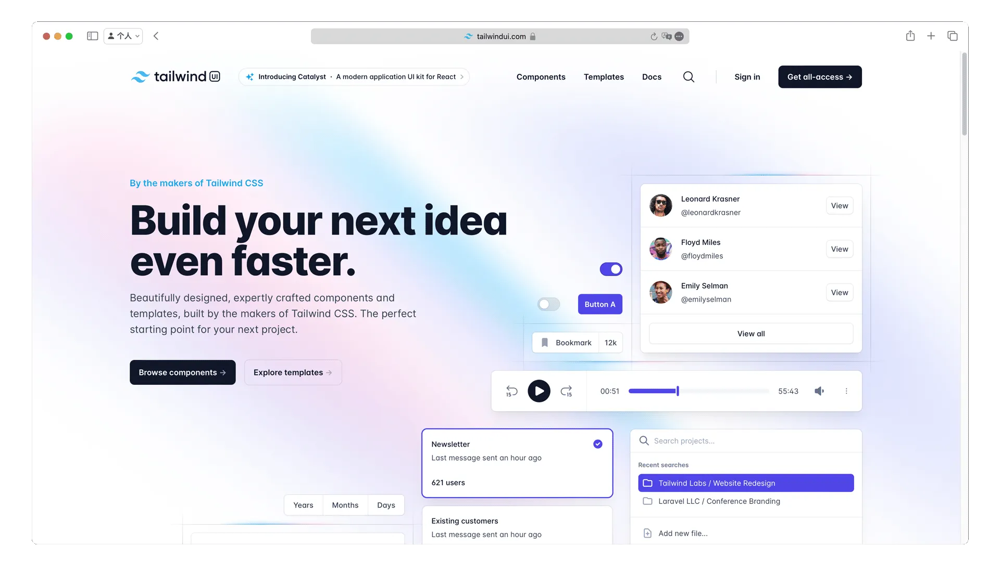
## Daisy UI
[https://daisyui.com/](https://daisyui.com/)

A large number of Tailwind components, including data inputs, layouts with many variants, many footers.

> 最流行的组件库为Tailwind CSS，daisyUI 将组件类名添加到 Tailwind CSS 中，因此您可以制作美丽的网站 比以往更快。
>

Daisy UI 相当于是在 Tailwind CSS 的基础上再进行了一次封装，daisyUI 为 Tailwind CSS 添加了类名,以支持所有常用的 UI 组件。类名如下 btn , card , toggle 等等。 Daisy UI的优势：

+ 55 组件，500+ 实用工具类。
+ 官网支持多语言。
+ daisyUI 是 Tailwind CSS 的插件。它适用于所有 JS 框架，不需要 JS 捆绑文件。
+ 无限主题：daisyUI 为Tailwind CSS 添加了一组可自定义的颜色名称，这些新颜色使用CSS变量作为值。使用daisyUI颜色名称，您可以获得暗模式和更多主题，而无需添加新的类名称。

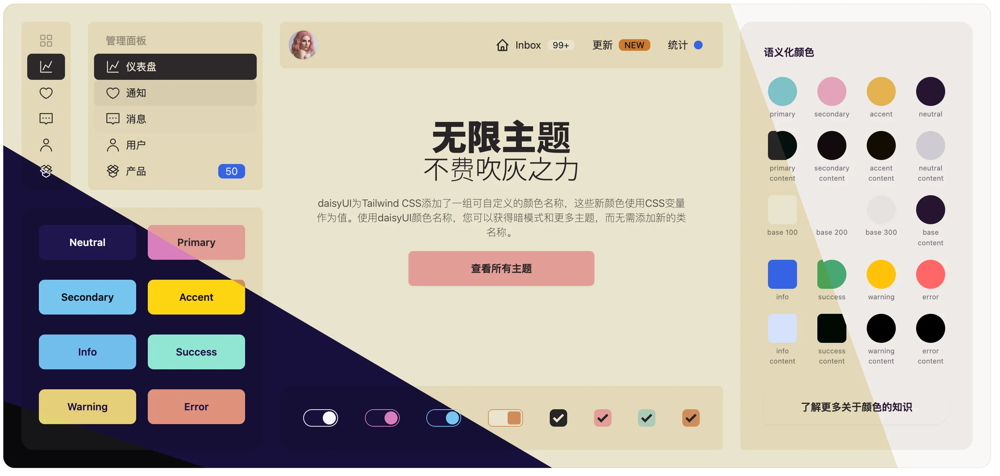
## Preline UI
[https://preline.co/](https://preline.co/)

> Preline UI 是一组开源的预构建 UI 组件，基于实用程序优先的 Tailwind CSS 框架。
>

Preline UI 是一个非常完善的 Tailwind CSS 组件库系统，750 多个免费组件和示例 数百个符合可访问性标准的组件示例，满足您网站的所有需求。Preline UI的优势：

+ 官方拥有丰富的Demo examples，Templates
+ 通用框架兼容性： 无论 Tailwind CSS 在何处运行，Preline UI 都完全兼容，从 React 到 Vue 等等。
+ 暗黑模式： 所有组件都包含一个暗色版本，当启用暗色模式时，您可以用不同的方式设计您的网站。

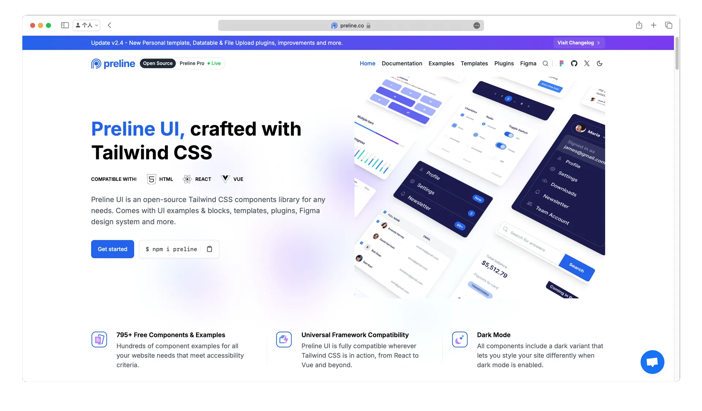
## Penguin UI
[https://www.penguinui.com/](https://www.penguinui.com/)

> Get Your Project Off The Ice Fast & Easy Plug-n-play UI component library for Tailwind CSS & Alpine JS
>

用户界面不仅仅是您所看到的。 Penguin UI 将帮助您应对复杂的情况，从而将您的创意变为现实。Penguin UI的优势：

+ 纯粹基于 Tailwind CSS & Alpine JS
+ 全栈式 UI Kits 基础套件
+ 多主题（13 个默认主题）
+ AI 组件库也就绪

## **MerakiUI**
➜ [MarekiUI](https://merakiui.com/) | [Github](https://github.com/merakiui/merakiui)

> 108 components with Tailwind classes. Supports "RTL" languages (right to left). Uses Flexbox and CSS grids. A Dark Mode is also available.19 categories of components available among which : Cards, CTA, FAQ, Navbars, Heros, Sidebar.
>

MerakiUI专注于提供美观且实用的组件，以增强用户体验。108 个带有 Tailwind 类的组件。支持“RTL”语言（从右到左）。使用 Flexbox 和 CSS 网格。还提供暗黑模式。19 个可用组件类别，其中包括：卡片、CTA、FAQ、导航栏、英雄、侧边栏、

该库提供了一系列免费组件，包括按钮、警报和卡片，所有这些组件都旨在与 Tailwind CSS 无缝集成。

对于希望在其应用程序中保持一致且有吸引力的设计的开发人员来说，MerakiUI 是理想的选择。

主要特点： 美观且实用的组件 与 Tailwind CSS 无缝集成 支持RTL 语言、响应式 flexbox 和 CSS 网格、暗黑模式 超过 50 个组件

用例：最适合设计美学高度优先的项目。

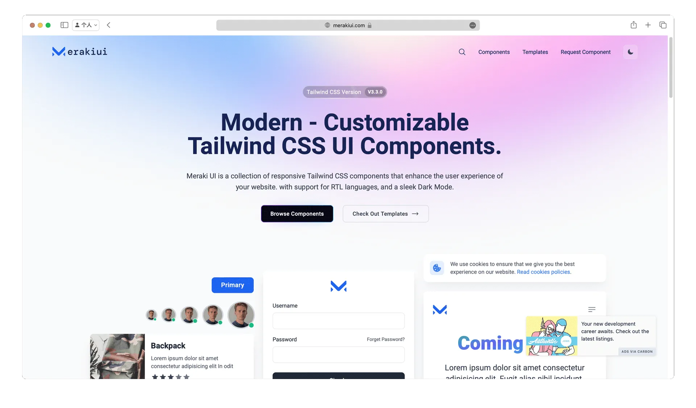

## **Flowbite**
使用 Tailwind CSS 构建的包含 400 多个组件的开源库。还提供表单组件。专业版还提供对其他组件的访问。

Open-source library of over 400 components built with Tailwind CSS. Form components are also available. A pro version also provides access to additional components.

➜ [Flowbite](https://flowbite.com/)

## **Pagedone.io**
> Build websites faster than ever before with our open-source library featuring 1000+ UI components, sections, and pages designed in Figma and built on Tailwind CSS. Save yourself from investing thousands of hours in building projects from the ground up and recreating identical elements. Pagedone UI provides all the resources for crafting contemporary and stunning UI and web designs.
>

使用我们的开源库，您可以比以往更快地构建网站，该库包含 1000 多个使用 Figma 设计并基于 Tailwind CSS 构建的 UI 组件、部分和页面。无需花费数千小时从头开始构建项目并重新创建相同的元素。Pagedone UI 提供制作现代且令人惊叹的 UI 和网页设计所需的所有资源。

➜ [Pagedone.io](https://pagedone.io/)

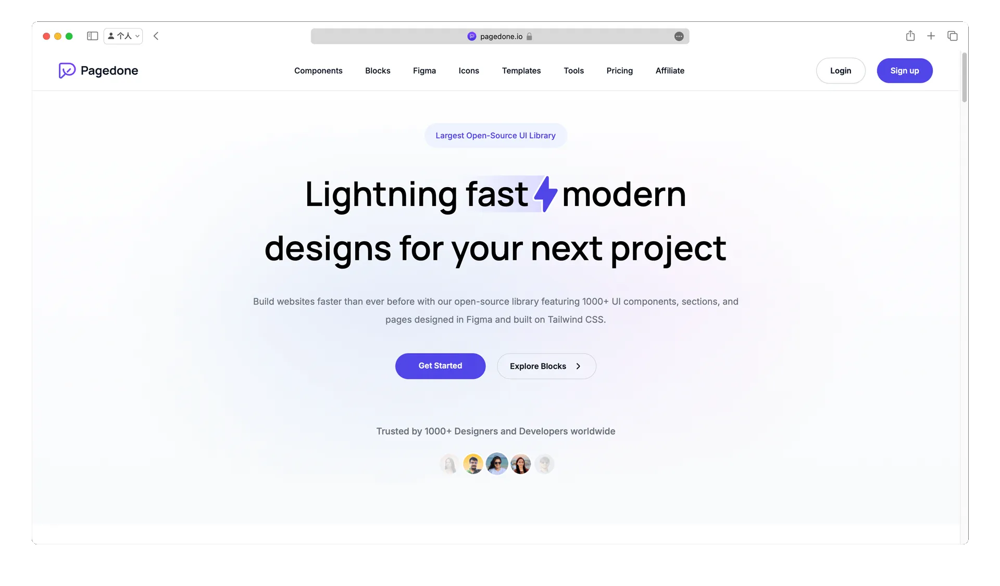
## **Mamba UI**
> Some components are free, but most of them are not. It's a pity because the library has some excellent components. The code can be downloaded in HTML or JSX. Useful to avoid renaming classes.
>

有些组件是免费的，但大多数组件不是免费的。这很可惜，因为该库中有一些非常优秀的组件。

代码可以以 HTML 或 JSX 格式下载。有助于避免重命名类。

➜ [MambaUI](https://mambaui.com/)

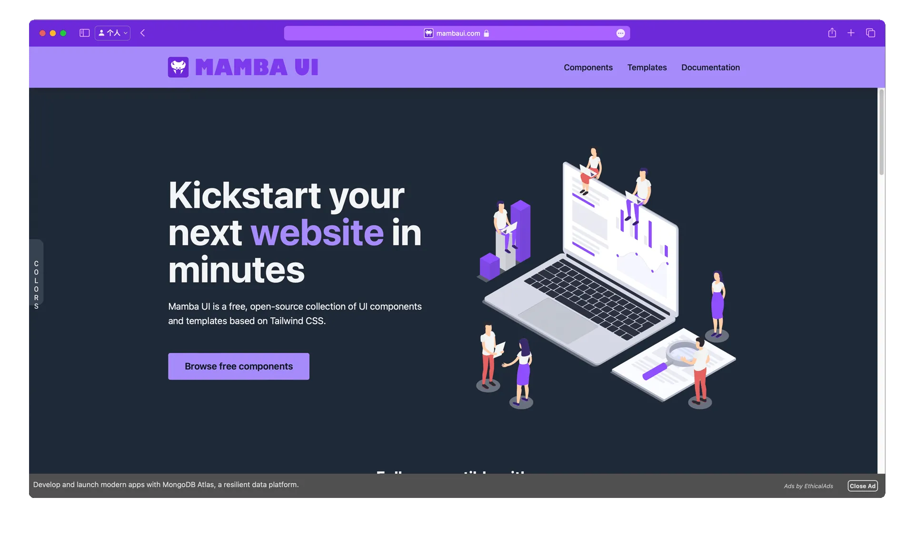
## **Kitwind**
Kitwind offers a set of 130 sections in its Kometa UI Kit. The Tailwind components code can be view and copied for free. Several sections are proposed: headers, nav, features, pricings, FAQs, Teams, Blogs, ...

Kitwind 在其 Kometa UI Kit 中提供了一组 130 个部分。可以免费查看和复制 Tailwind 组件代码。建议使用几个部分：标题、导航、功能、定价、常见问题解答、团队、博客……

➜ [KitWind](https://kitwind.io/products/kometa/components)

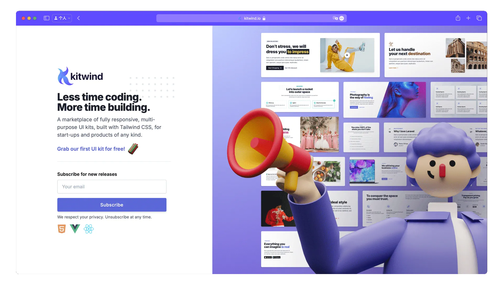
## **Material Tailwind**
> A rather limited number of components. The library also offers a React version of the components integrating some actions related to the components.
>

组件数量相当有限。该库还提供了组件的 React 版本，集成了一些与组件相关的操作。

➜ [Material Tailwind](https://www.material-tailwind.com/)

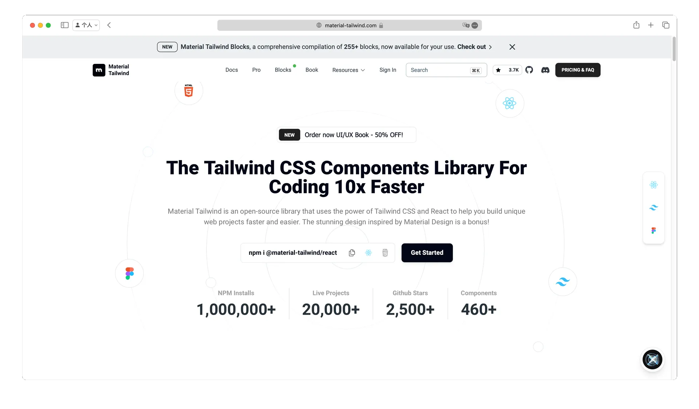
## **Tail Blocks**
> A large number of clean components. The code for all Tailwind components can be downloaded for free.
>

大量简洁的组件。所有 Tailwind 组件的代码都可以免费下载。

➜ [Tailblocks](https://tailblocks.cc/)

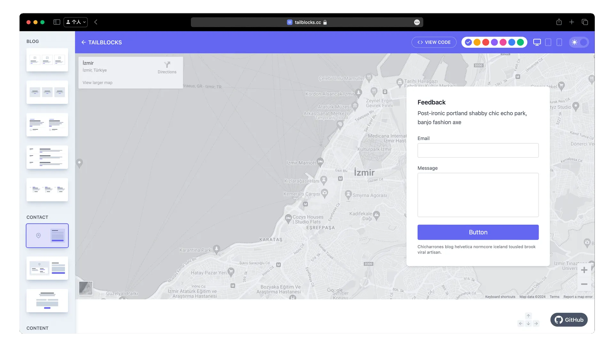
## **Tailwind UI Kit**
> 1000 components, many of which are paid, and 30 templates. The components are classified in three main categories: web app, marketing and ecommerce.For ecommerce sites, it is a very interesting library because of the number of components offered.
>

1000 个组件（其中许多是付费的）和 30 个模板。这些组件分为三大类：Web 应用、营销和电子商务。

对于电子商务网站来说，这是一个非常有趣的库，因为它提供的组件数量众多。

➜ [Tailwind UI Kit](https://tailwinduikit.com/components)

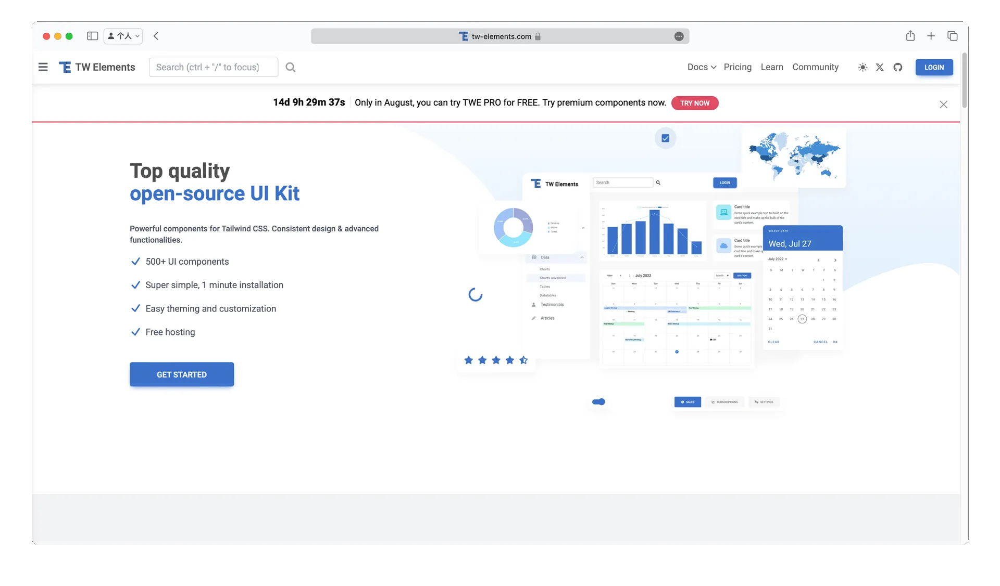
## TailGrids
[https://tailgrids.com/](https://tailgrids.com/)

Tailwind CSS UI components, blocks, sections, and templates crafted for web apps, marketing, e-commerce, dashboards, and more — Browse and effortlessly copy-paste from over 600 components and templates to craft high-quality, custom Tailwind CSS websites without coding or designing from scratch. Now available for HTML, React, Vue, and Figma!

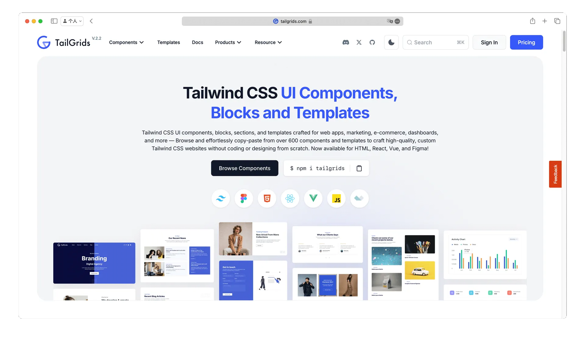
## Themes.Dev
[https://www.themes.dev](https://www.themes.dev/)

Premium Tailwind CSS Themes and Components Handcrafted themes and components to take-off your next project. Written in your favorite framework Tailwind CSS.

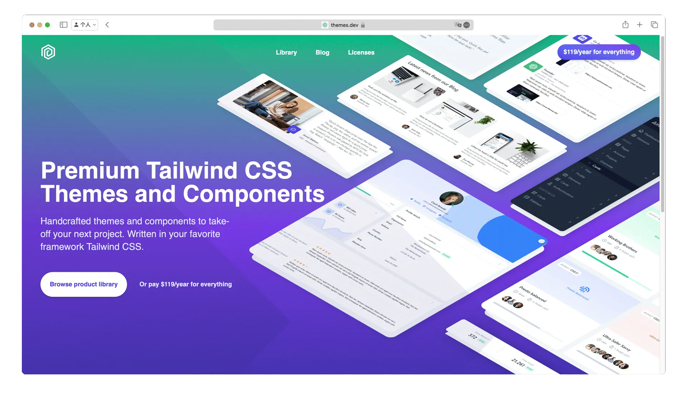
## HyperUI
[https://www.hyperui.dev/](https://www.hyperui.dev/)

> HyperUI is a collection of free Tailwind CSS components that can be used in your next project. With a range of components, you can build your next marketing website, admin dashboard, eCommerce store and much more.
>

HyperUI是一个免费的开源 Tailwind CSS组件，适用于营销和电子商务网站，提供满足不同需求的多样化组件。

无论您需要表单、卡片还是导航菜单，HyperUI 都能提供遵循 Web 开发最佳实践且设计精良、易于实现的组件。

它带有纯 HTML、JSX 和 VUE。

主要特点： 多种组件 设计和实施的最佳实践 超过 100 个组件 免费且开源

用例：该库旨在通过提供可立即使用的 UI元素来加快开发时间。

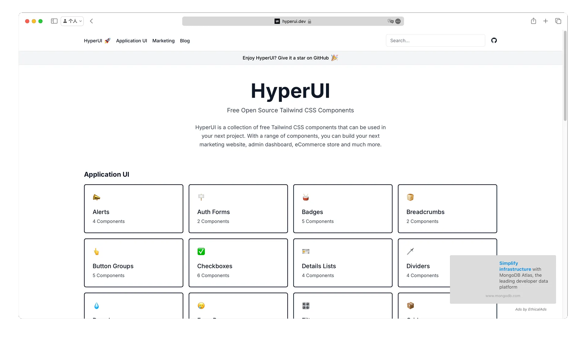
## Sailboat UI
[https://sailboatui.com/](https://sailboatui.com/)

Sailboat UI is a modern UI component library for Tailwind CSS. Get started with 150+ open-source Tailwind CSS components, and make it easy to build your products.

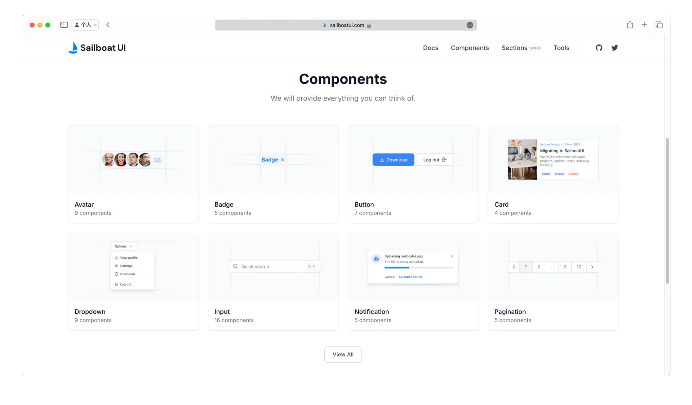
## Wind UI
[https://wind-ui.com/](https://wind-ui.com/)

> Streamline your Tailwind CSS projects Expertly made, responsive, accessible components in React and HTML ready to be used on your website or app. Just copy and paste them on your Tailwind CSS project.
>

Wind UI提供了一组免费的、完全响应且可访问的组件，旨在与 Tailwind CSS 完美配合。 该库涵盖各种 UI 元素，从导航栏到表单，确保您拥有任何项目所需的构建块。 它带有纯 HTML 组件以及 React 组件。只需将它们复制并粘贴到您的项目中即可。 Wind UI 强调简单和极简主义，确保组件保持轻量且易于实现。

主要特点： 响应式设计 可访问组件 简洁明了的设计 42 个具有多种变体的组件 Figma社区设计

用例：非常适合寻找轻量级和简约 UI 组件的开发人员。

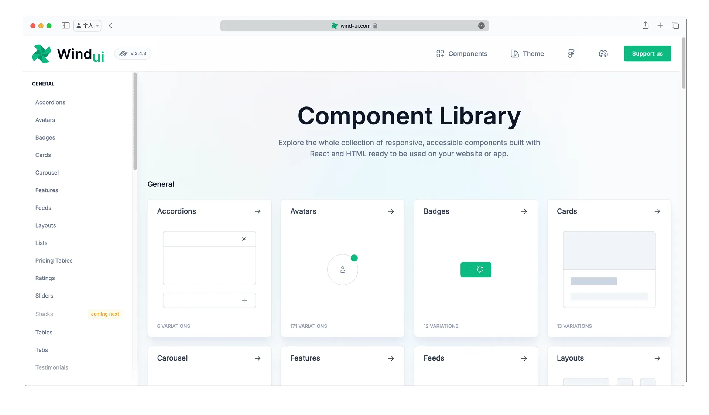
## Ripple UI
[https://www.ripple-ui.com](https://www.ripple-ui.com/)

> Ripple UI Ultimate toolkit for modern interface design. Ripple UI is a collection of components and utilities that are used to build modern interfaces. It is built on top of Tailwind CSS.
>

RippleUI是另一个优秀的库，它为 Tailwind CSS 提供了一套全面的免费组件，可以将其视为 Bootstrap 或另一个类似的 UI 库，但具有 Tailwind CSS 的强大功能。

它专注于提供简洁、现代且易于定制的 UI 元素。

虽然它看起来很简单，但它对于小型项目来说是一个理想的解决方案。

对于那些想要使用具有专业外观的组件来增强项目而又不需要 JavaScript 开销的开发人员来说，RippleUI 是完美的选择。

主要特点： 简洁现代的设计 一套全面的组件（超过 50 个组件） 轻松定制，支持暗黑模式

用例：非常适合寻求现代且易于定制的组件的开发人员。

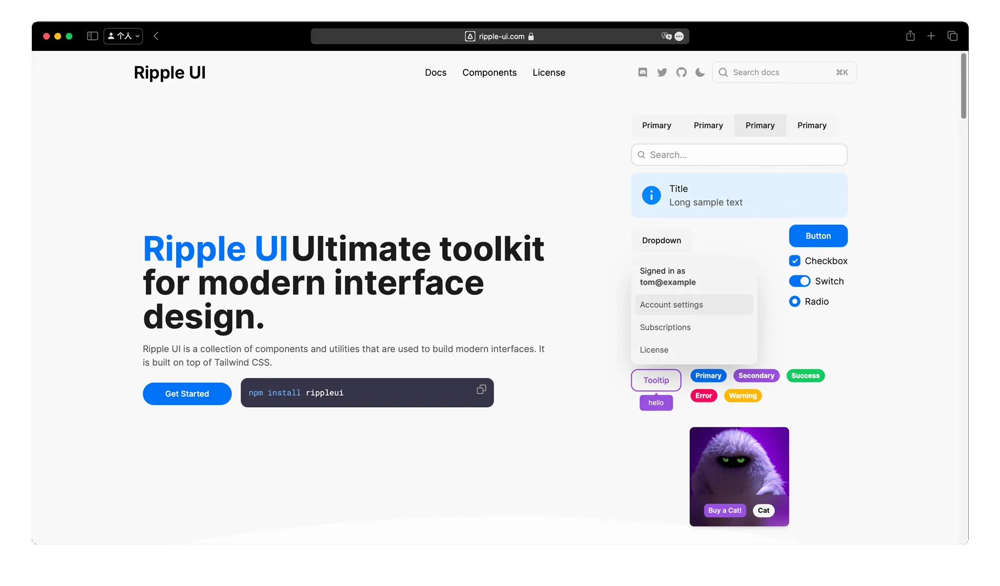
## KonstaUI
[https://konstaui.com/](https://konstaui.com/)

Pixel perfect mobile UI components built with Tailwind CSS With iOS and Material Design components for React, Vue & Svelte

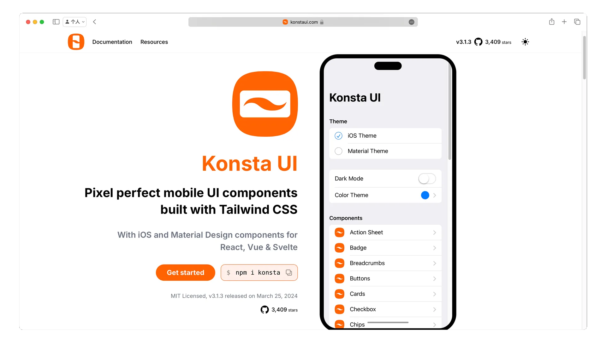
## Cruip
[https://cruip.com/](https://cruip.com/)

Landing pages, websites, and dashboards built on top of Tailwind CSS and fully coded in HTML, React, Next.js, and Vue. A great starting point for your next project, saving you weeks of development time.

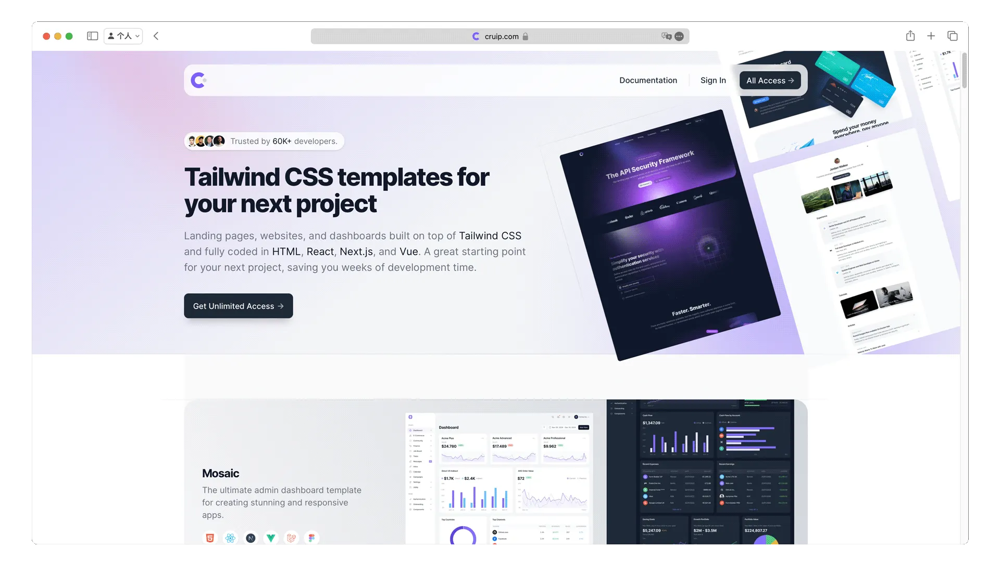
## Creative-Tim
[https://www.creative-tim.com/](https://www.creative-tim.com/)

Fully Coded UI Tools to create web and mobile apps UI Kits, Templates and Dashboards built on top of Tailwind CSS, Bootstrap, Vue.js, React, Angular, Node.js and Laravel. Join over 2,563,477 creatives to access all our products!

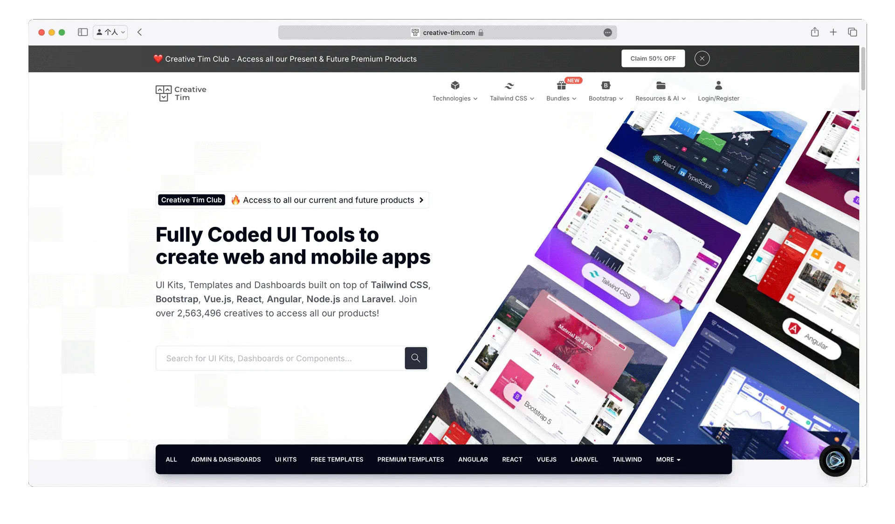
## Tailwind Awesome
[https://www.tailwindawesome.com/](https://www.tailwindawesome.com/)

Discover the best Tailwind templates & UI kits Tailwind Awesome is a curated list of the best Tailwind templates & UI kits in the internet. We are actively searching, and curating the coolest resources out there.

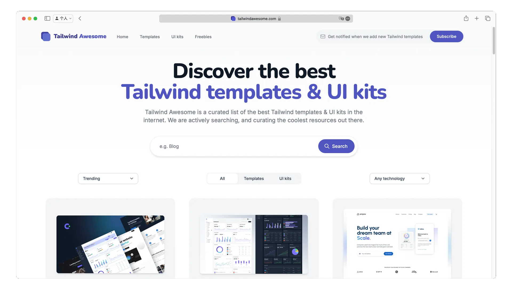
## UIDesk
[https://uideck.com/tailwind-templates](https://uideck.com/tailwind-templates)

Free Tailwind CSS templates for startup, saas, software and business websites. These templates will help you design a professional website without the need to code. Our clean and modern designs will impress your customers and provide a great user experience on any device. Tailwind is the next-generation solution for websites. You can utilize its vast set of features for rapid development, customizable styling, visual consistency, and technical efficiency. Tailwind CSS Framework is a new way for you to approach your CSS! If you're tired of the same old boring grids, styles, and snippets, Tailwind will give you a whole new way to think about how to style your website. No more worrying about the size of the viewports either. Tailwind is completely mobile-first and can be used on any project.
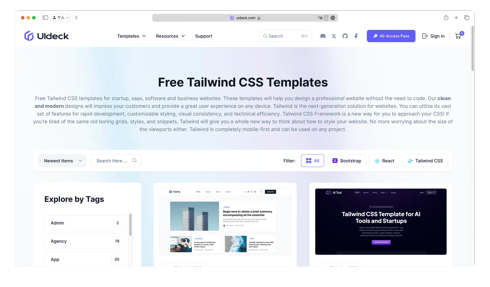
## 总结
使用预构建的组件库可大大简化开发过程，使您能够专注于尽快构建项目。

本文收集了全网使用 Tailwind CSS 的开发人员提供了极好的资源，无需 JavaScript 即可提供轻量且易于实现的组件，而且是免费的。至少对我来说，我选择这些库来构建我的下一个业余项目。它们为我提供了 UI 所需的一切，并让我可以自由选择我想要的 JS 框架。  

