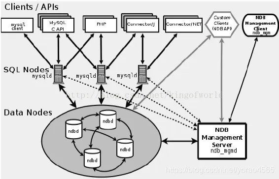
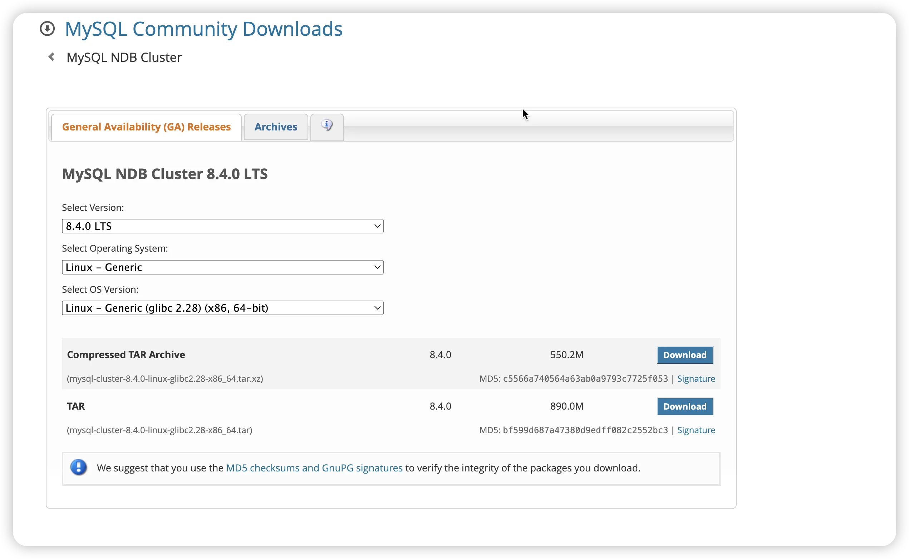

## 前言
Mysql Cluster是两项技术的结合：NDB数据库，以及作为SQL前端的MySQL存储引擎。NDB是一个分布式，具备兼容性、非共享的数据库，提供同步复制以及节点间的数据自动分片。  


## MySQL Cluster基本架构
+ 管理节点(ndb_mgmd)  
负责管理其他各节点IP地址、内存分配以及保存数据路径；
+ 数据节点(ndbd)  
负责存储数据；
+ SQL节点(mysqld)  
提供SQL 的API调用功能，简单地讲就是mysqld服务器  
其中管理节点最好单独部署，数据节点和SQL节点可以部署在一起；

## 准备工作
### 安装包下载
链接: [https://dev.mysql.com/downloads/cluster/8.4.html#downloads](https://dev.mysql.com/downloads/cluster/8.4.html#downloads)  
如下图所示：



### 集群规划
| 节点 | IP |
| --- | --- |
| 管理节点 | 10.211.55.8 |
| 数据节点 | 10.211.55.9 |
| 数据节点 | 10.211.55.10 |
| SQL节点 | 10.211.55.9 |
| SQL节点 | 10.211.55.10 |


建议采用内网IP，使用外网IP需要考虑host以及网卡设置等情况，需要提前完成配置

### 彻底卸载mysql
需要将以上各IP中msyql服务彻底卸载，包括关闭mysql相关服务、卸载软件以及删除与mysql相关的文件；

### 端口开放
集群中个节点需要开放相应端口，MySQL Cluster所用端口为1186、2202，mysql端口为3306

## 集群搭建
修改远程 root 权限 使用 vscode 连接虚拟机

```plain
vim /etc/ssh/sshd_config


添加
PermitRootLogin yes	
PermitEmptyPasswords no

重启
systemctl restart ssh

```


### 管理节点
#### MySQL Cluster 软件安装
解压缩安装包后，复制到指定位置 /home

```plain
cp mysql-cluster-8.4.0-linux-glibc2.28-aarch64.tar.xz /home
cd /home
```

使用 vscode 登录 root 连接虚拟机

####  添加用户权限
添加安装需要相关用户权限

```plain
groupadd mysql
useradd mysql -g mysql
cd /usr/local/mysql-cluster/
chown -R root .
```

#### 管理程序拷贝
```plain
cp bin/ndb_mgm* /usr/local/bin
cd /usr/local/bin
chmod +x ndb_mgm*

```

#### 配置文件
新建管理节点的配置文件config.ini

```plain
mkdir /var/lib/mysql-cluster/
cd /var/lib/mysql-cluster/

mkdir /var/lib/mysql/data
chmod 777 /var/lib/mysql/data
mkdir /usr/local/mysql
mkdir /usr/local/mysql/mysql-cluster

```

安装 vim

```plain
apt-get update
apt-get install vim
```

config.ini配置内容为：

```plain
[ndbd default]
NoOfReplicas=2                  #数据写入数量。2表示两份,2个数据节点
DataMemory=80M                  #配置数据存储可使用的内存
IndexMemory=10M                 #索引给100M

[ndb_mgmd]
NodeId=1
hostname=10.211.55.8
datadir=/var/lib/mysql-cluster

[ndbd]
NodeId=2
hostname=10.211.55.9
datadir=/var/lib/mysql

[ndbd]
NodeId=3
hostname=10.211.55.10
datadir=/var/lib/mysql

[mysqld]
NodeId=4
hostname=10.211.55.9

[mysqld]
NodeId=5
hostname=10.211.55.10
```

其中：  
[NDBD DEFAULT]  
代表每个ndbd节点的默认设置，包括：

+ NoOfReplicas ：每份数据在不同节点上的存储份数，根据实际情况确定
+ DataMemory ：数据存储占用内存
+ IndexMemory ： 索引存储占用内存

[NDB_MGMD]  
代表管理节点的设置，包括：

+ NodeId：节点ID
+ hostname：管理节点IP地址，推荐采用内网IP
+ datadir：管理节点数据存储位置

[NDBD]  
代表ndb数据节点的配置，包括：

+ NodeId：节点ID
+ hostname：数据节点IP地址，推荐采用内网IP
+ datadir：数据节点数据存储位置

[msyqld]  
代表SQL节点的设置，包括：

+ NodeId：节点ID
+ hostname：SQL节点IP地址，推荐采用内网IP

#### 管理节点启动
```plain
ndb_mgmd -f /var/lib/mysql-cluster/config.ini --initial --ndb-nodeid=1
第一次启动后 不需要再带--initial

ndb_mgmd -f /var/lib/mysql-cluster/config.ini  --ndb-nodeid=1

如果找不到命令
cd /usr/local/mysql-cluster/bin
./ndb_mgmd -f /var/lib/mysql-cluster/config.ini  --ndb-nodeid=1

```

显示MySQL Cluster Management Server mysql-.....则代表安装正确  
查看管理节点运行情况：

```plain
ndb_mgm -e show
```

由于数据节点和sql节点尚未启动，所以看不到节点信息  
管理节点初始化之后，再启动就不需要–initial后缀，管理节点的关闭命令为：

```plain
/usr/local/bin/ndb_mgm -e shutdown
```

#### 常见问题
1. 找不到相关目录：新建相关目录
2. hostname无法连接：确认IP地址是否可用，并且能够网卡配置与host配置支持使用该IP地址

### 数据节点
#### MySQL Cluster 软件安装
解压缩安装包后，复制到指定位置，与管理节点一致

```plain
安装 解压...
cd /usr/local/mysql-cluster
./bin/ndbd --initial
```

#### 添加用户权限
```plain
groupadd mysql
useradd mysql -g mysql
```

#### 配置文件
由于本文中数据节点与SQL节点共用一台机器，所以配置文件my.cnf中既有数据节点配置也有SQL节点配置

```plain
vim /etc/my.cnf
```

my.cnf

```plain
[mysqld]
basedir=/usr/local/mysql-cluster
datadir=/usr/local/mysql-cluster/data
ndbcluster
ndb-connectstring=10.211.55.8
default-storage-engine=NDBCLUSTER
skip-grant-tables
bind-address=0.0.0.0
port=3306

[mysql_cluster]
ndb-connectstring=10.211.55.8

[ndbd]
ndb-connectstring=10.211.55.8


[mysql]
socket=/tmp/mysql.sock

```

其中，需要注意的配置为：  
datadir：需要与管理节点config.ini中的数据节点datadir保持一致  
ndb-connectstring：配置文件中都设置为管理节点IP地址

#### 数据节点启动
```plain

初始化 
./bin/mysqld --initialize --user=mysql --ndb-nodeid=4 

初始化操作需要一定时间执行，执行完成后末尾会有初始密码，改密码为需要记录
初始化完成后，将mysql程序复制到启动目录下，方便mysqld服务启动


apt-get install numactl
```

数据节点初始化后，之后再次启动就不需要–initial后缀

回到管理节点，查看集群状态，发现数据节点已经连接

```plain
ndb_mgm -e show
```

#### 常见问题
1. 找不到相关文件和文件夹：新建相关文件和文件夹
2. IP地址无法连接：查看管理节点和数据节点本身网卡设置与端口开放情况

### SQL节点
由于本文中数据节点与SQL节点部署在同一台机器上，所以不需要再进行软件安装，配置文件也已经配置完成

#### 添加用户权限
```plain
cd /usr/local/mysql-cluster/
mkdir logs
mkdir data
chown -R mysql:mysql ./

```

根据配置文件创建相关文件夹，本文为了方便直接将log和data文件都建立在安装目录下，建议实际使用时修改位置，但是各文件夹都需要增加mysql用户权限

#### msyqld服务初始化
需要对mysqld服务进行初始化操作

```plain
./bin/mysqld --ndb-nodeid=4 --user=mysql
```

初始化操作需要一定时间执行，执行完成后末尾会有初始密码，改密码为需要记录  
初始化完成后，将mysql程序复制到启动目录下，方便mysqld服务启动

```plain

cp support-files/mysql.server /etc/init.d/mysqld
chmod +x /etc/init.d/mysqld


启动
service mysqld start

```

回到管理节点，查看集群状态，发现数据节点已经连接

```plain
ndb_mgm -e show
```

#### 常见问题
1. 必须启动全部数据节点才能启动SQL节点，否则连接不上
2. mysqld初始化时需要data目录为空
3. 出现缺少文件、目录错误时建议新建相关文件、文件夹

## 集群启停
启动顺序为：1.管理节点；2.数据节点（全部）；3.SQL节点

## 测试
参考文件 readme.md和昨天视频

